# System One Models (Jev, Laya)
## Research Report and Comparison with Decision Trees and Classical ML

---

## 1. Executive Summary

- **What they are.** "System One models" are text classifiers that answer typed questions
  (choice / score / yes-no) about a piece of text and return **calibrated probabilities**
  instead of generated prose. The two products are **Laya** (Convai Innovations, open source,
  Apache 2.0) and **Jev** (TypeSafe AI, commercial API, launched September 2026).
- **How Laya works (public).** A pretrained bidirectional encoder (ModernBERT-large, 395M)
  reads the question, the candidate options and the input text together. Each option gets a
  `[MASK]` marker; a small head turns each marker into one score; a softmax over the options
  gives the probabilities. **One forward pass, no token generation.**
- **How Jev works.** Not published. TypeSafe says only "a new architecture, a new sampler, and a
  new training algorithm" (RLCD). Community reimplementations (`simple-jev`) read the logits of
  a decoder LLM at a single position; that is guesswork, not confirmed.
- **Is System One like running data through a decision tree?**
  - **At inference: yes, strongly.** Both are one-pass, fixed-cost, closed-label-set models that
    output class probabilities and can abstain on low confidence. Neither can "hallucinate" a
    label outside the allowed set.
  - **At training: no.** A decision tree (CART) is fit greedily in one run with no gradient descent
    and no epochs. A System One model sits on top of a transformer pretrained on trillions of
    tokens, is fully fine-tuned, and is then trained with many iterations of policy gradient
    (RLCD). It is at the opposite end of the training-cost spectrum.
  - "One pass" in the System One pitch means **non-autoregressive inference** (not generating
    token after token like an LLM). It says nothing about training.
- **Nearest classical relative.** Not a decision tree, but a **fine-tuned BERT classifier**
  (2018-era NLP), specifically the multiple-choice / cross-encoder variant plus zero-shot NLI
  classification. The genuinely new parts are (a) options defined at request time in natural
  language, (b) training explicitly for calibration, and (c) a built-in act/escalate head.
- **Critical caveat.** Laya's own model card says the base checkpoints are **near chance
  zero-shot** (0.36 vs 0.32 random) on its typed-decisions benchmark. The headline 0.766 score is
  a checkpoint fine-tuned on that benchmark's domain. In practice you fine-tune on labelled data,
  which is ordinary supervised learning.

---

## 2. Background: Why "System One"?

The name borrows from Daniel Kahneman's dual-process theory (*Thinking, Fast and Slow*):

| Kahneman | AI mapping (vendor framing) | Traits |
|---|---|---|
| System 1 - fast, intuitive | System One models (Jev, Laya) | Fixed-cost, typed output, calibrated, cannot generate |
| System 2 - slow, deliberate | LLMs (GPT, Claude, Gemini) | Token-by-token generation, flexible, can hallucinate |

The pitch: in an agent pipeline, most steps are small decisions (route this ticket, is this
safe, which category). Using a multi-billion-parameter generative LLM for each is slow, costly and
returns text you must parse. A System One model returns a typed answer plus a probability that
software can threshold.

Note that the analogy is marketing. Kahneman's System 1 is error-prone and bias-driven; the vendors
emphasise speed and invert the connotation to "reliable".

---

## 3. How Laya Works (verified from primary sources)

### 3.1 Architecture

| Component | Detail |
|---|---|
| Backbone | ModernBERT-large, 395M params, 28 layers, hidden 1024, bidirectional, fully fine-tuned |
| Decision head | 2 TransformerEncoder layers (d=1024, 16 heads, FFN 4096), trained from scratch |
| Option scorer | MLP per `[MASK]` marker: LayerNorm -> Linear(1024,1024) -> GELU -> Linear(1024,1) |
| Act/escalate head | ~0.26M params; input = pooled `[CLS]` + 4 stats (max prob, top-2 margin, normalised entropy, option budget ratio) |
| Total | ~421M params (English); multilingual variant on mmBERT-base, 322M |
| Context | 512 tokens (English); 1,024 for multilingual and typed-decisions (extendable to 8,192 via RoPE) |

Input layout:

```
[CLS] <type> question: <instructions> [SEP] [MASK] option0 [MASK] option1 ... [SEP] <state> [SEP]
```

Each option's `[MASK]` hidden state becomes one logit; softmax over that question's options gives
the probability distribution. **The answer space is part of the input, not the output layer**, so
new label sets need no retraining (in principle; see the zero-shot caveat in 3.4).

Confidence is normalised entropy: `confidence = 1 - H(p) / log(K)`.

### 3.2 Decision primitives

| Primitive | Returns |
|---|---|
| `choice` | top label, per-option probabilities, confidence |
| `score` | expected level on an ordinal rubric, distribution, confidence |
| `noul` | calibrated P(true), 0.0 to 1.0 (yes/no) |

Jev exposes the same three names (Choice, Score, Noul). `laya[serve]` offers a Jev-compatible
`/v1/systemone` endpoint.

### 3.3 Training: RLCD (Reinforcement Learning for Calibrated Decisions)

The model's output distribution `q` is treated as a "policy". The reward is a **strictly proper
scoring rule**, i.e. one whose expected value is maximised only when `q` equals the true outcome
distribution:

```
Reward(q, y) = S_log(q, y) + 0.5 * S_sph(q, y) - 1.0 * S_rps(q, y)
```

- `S_log` - logarithmic score (log of the probability assigned to the true answer)
- `S_sph` - spherical score (bounded, gentler gradients)
- `S_rps` - ranked probability score, for ordinal `score` questions only

Update rule (GRPO-style REINFORCE):
1. Sample G=8 noisy copies of the logits: `z + epsilon`, epsilon ~ N(0, sigma^2); sigma decays 1.0 -> 0.3.
2. Score each noisy distribution with the reward.
3. Advantage = (reward - group mean) / group std.
4. Loss = -mean(advantage * log_prob(noisy logits)).

Plus: a cost-sensitive act head (+1 correct, -3 wrong, -0.5 escalate, so it learns to act only when
P(correct) > 0.625), and TD(lambda=1) for multi-turn conversations.

Data: stated as 100% human-labelled public datasets (triage, fact checking, safety, rubrics,
SaaS conversations), with option shuffling, question paraphrasing and distractor questions.
After training, a **temperature per question type** is fitted for calibration.

### 3.4 Honest limitations (from Laya's own README)

- **Near chance zero-shot:** base checkpoints score 0.362 / 0.352 on typed-decisions vs 0.318
  random. The README calls Laya "a fast base to specialise, not a zero-shot decision engine."
- **Over-confident as shipped:** ECE 0.466 before temperature scaling, 0.081 after.
- **High cardinality:** Banking77 (77 labels) 0.425 vs Jev 0.870.
- **Label bias:** `noul` and `choice` can follow the wording of labels (yes/no, true/false)
  instead of the text; negated requests ("do NOT cancel") were misclassified in tests.
- **Position bias** on `score` questions (multilingual checkpoint).
- **Script collapse:** English checkpoint scores 0.000 at 0.952 confidence on Khmer - hence the router.
- `act_probability` currently carries no usable signal (AUROC 0.30); use `confidence` instead.

---

## 4. How Jev Works (what is and is not known)

| Claim | Status |
|---|---|
| Returns typed answers + probabilities + confidence; no text generation | Confirmed (docs) |
| Questions evaluated in parallel and in isolation in one request | Confirmed (docs) |
| Trained with RLCD; "new architecture, new sampler, new training algorithm" | Vendor claim, no paper |
| $42 per billion input tokens; "238x cheaper than Claude Fable 5.1" | Vendor claim |
| "193.6x faster, 444.6x cheaper than LLMs on System One tasks" | Vendor claim |
| Based on ModernBERT-large 421M, 512 context | **Not found in TypeSafe sources** - this matches Laya's spec; likely conflated in the wiki |
| Reads decoder-LLM logits after a half-finished `{"answer": "` prefix ("logit trick") | Community reverse-engineering (`simple-jev`), speculative |

The "logit trick" article (Boopathi) is useful mainly for explaining where the speed claims come
from: skipping the decode loop. A 1,000-token prompt plus 15 decode steps becomes a 1,000-token
prompt plus one logit read. Savings shrink as the input gets longer, because the input
still has to be read.

Docs guidance worth noting: questions should be "atomic"; anything requiring "extended reasoning or
weighing multiple independent factors" should be decomposed.

---

## 5. Benchmarks (with provenance)

All numbers are vendor or competitor published; none are independently audited.

**Typed-decisions (2,000 decisions, 4 workflows) - source: Laya README**

| Metric | laya-typed-decisions (fine-tuned) | laya (base) | laya-multilingual (base) | Jev 1.13.0 |
|---|---|---|---|---|
| Accuracy | **0.766** | 0.362 | 0.352 | 0.727 |
| Soft accuracy | 0.471 | 0.332 | 0.328 | **0.580** |
| Brier (lower better) | **0.062** | 0.316 | 0.463 | 0.148 |
| ECE (lower better) | 0.213 | 0.175 | 0.314 | **0.144** |
| Score MAE | **0.242** | 0.694 | 0.760 | 0.391 |

Note that on this benchmark Jev has the **better calibration (ECE)**, contrary to the wiki's summary.

**Latency (Tesla T4, Laya README)**

| Questions | laya | laya-multilingual | Jev (as cited by Laya) |
|---|---|---|---|
| 1 | 39.5 ms | 32.8 ms | p50 236-276 ms |
| 10 | 158.6 ms | 72.3 ms | - |
| 50 | 771 ms | 337 ms | - |

Jev latency figures conflict across sources: 236-276 ms p50 (Laya README), "~400 ms avg, best
~150 ms" (Laya author's Dev.to post), 0.114 s end-to-end (TypeSafe). Treat all of them as marketing
until you measure them yourself.

---

## 6. The Core Question: Is System One Like a Decision Tree?

### 6.1 Separate the two phases

The confusion comes from the word "pass". Every ML model has two phases:

| Phase | Decision Tree (CART / C4.5) | System One (Laya) | LLM (GPT/Claude) |
|---|---|---|---|
| **Training** | Greedy recursive partitioning. No gradients, no epochs, no learning rate. Scans the data at each node to find the best split, then stops. Deterministic. | Iterative: (1) ModernBERT pretraining on trillions of tokens, (2) full fine-tuning, (3) thousands of RLCD policy-gradient steps with noise sampling, (4) temperature fitting. | Iterative: pretraining + SFT + RLHF. |
| **Inference** | **One pass**: walk root to leaf, O(depth) comparisons. | **One pass**: one encoder forward pass, fixed cost. | **Many passes**: one forward pass per generated token. |

So:
- **"One-pass inference" - System One is like a decision tree.** But so is every classical
  classifier (logistic regression, random forest, SVM, gradient boosting, a plain neural net). The
  "one pass" novelty is relative to LLMs, not relative to classical ML. It brings LLM-era
  models back to a normal classifier interface.
- **"One-pass, non-iterative training" - System One is the opposite of a decision tree.** It is
  among the most iteratively trained model families in existence.

A small correction on decision trees: tree induction is non-iterative in the optimisation sense (no
repeated weight updates), but it does look at the data many times. Each node re-scans its subset
to evaluate candidate splits, costing roughly O(n * m * log n). It is "one fit", not
literally "one pass over the dataset". Naive Bayes is the classical model that truly trains in a
single pass (counting frequencies).

### 6.2 Real similarities (inference behaviour)

| Property | Decision Tree | System One |
|---|---|---|
| Output | Class label from a closed set | Label from a closed set (options) |
| Probabilities | Leaf class frequencies | Softmax over option logits |
| Cannot invent a label | Yes | Yes (the "zero hallucination" claim is exactly this) |
| Fixed, predictable latency | Yes (depth-bounded) | Yes (one forward pass) |
| Abstention / reject option | Threshold on leaf purity/probability | `min_confidence`, act/escalate head |
| Raw probabilities over-confident | Yes: pure leaves give 0.0/1.0 | Yes: ECE 0.466 as shipped |
| Post-hoc calibration fix | Platt scaling / isotonic regression | Temperature scaling |

The calibration parallel is worth dwelling on. It is the same problem with the same family of fixes.
RapidMiner already ships a **Platt Scaling** operator (see `rapidminer/samples/08_Other/`), which is
essentially what Laya does with temperature scaling, one level up.

### 6.3 Real differences

| Dimension | Decision Tree | System One |
|---|---|---|
| Input | Tabular features you engineer | Raw text (question + options + document) |
| Label set | Fixed at training time | Defined at request time in natural language |
| Knowledge | Only what is in your training table | Language knowledge from pretraining |
| Interpretability | White box: read the split rules | Black box: 421M parameters |
| Training data need | Hundreds to thousands of rows | Pretrained base + domain fine-tuning (base is near chance zero-shot) |
| Training compute | Seconds on a CPU | GPU-days (pretraining is sunk cost, borne by others) |
| Inference compute | Microseconds, CPU | ~33-40 ms, GPU (or slower on CPU/ONNX) |
| Handles negation, paraphrase, language | No (only through features) | Partially (known failures on negation) |

### 6.4 The more accurate classical analogy

System One is best understood as a **2018-style fine-tuned BERT classifier** with three upgrades:

1. **Options as input, not output neurons.** Like `BertForMultipleChoice` / cross-encoders, and
   like Hugging Face's zero-shot classification pipeline (NLI model scoring "this text is about
   {label}"). That is what makes the label set dynamic.
2. **Calibration-targeted training.** RLCD rewards proper scoring rules. Analytical note: the
   log score is the negative of the cross-entropy loss, and cross-entropy is itself a strictly
   proper scoring rule. The claim that "cross-entropy drives over-confidence" is really about
   over-fitting (Guo et al., 2017, *On Calibration of Modern Neural Networks*), not the loss
   being improper. What RLCD adds is the noise-sampling exploration, the spherical and RPS terms,
   and the cost-sensitive act head. Given that Laya still ships over-confident and needs
   temperature scaling, the calibration gain from RLCD itself is **unproven**.
3. **Built-in escalation.** A learned "act vs ask a human" head. This is a classic reject-option
   classifier (Chow, 1970), packaged as a feature.

### 6.5 Where decision trees and System One meet in practice

This is where the two ideas combine usefully:

- **A decision tree of System One questions.** Jev's docs say "decompose into atomic questions".
  Laya's README says to handle 77 labels by "splitting into coarse/fine questions". A flowchart of
  atomic `noul`/`choice` calls is literally a decision tree whose split tests are
  natural-language questions answered by a neural model. You get the tree's readable,
  auditable structure plus the model's language understanding at each node.
- **System One as a feature extractor for a tree/GBM.** Run Laya over free-text fields (ticket
  body, invoice note, claim description) to produce columns like `P(churn_threat)`,
  `urgency_level`, `department`. Then feed those plus your structured columns into a
  decision tree or gradient-boosted model. Text becomes tabular, and the downstream model stays
  explainable.
- **Tree as a distilled student.** If a System One pipeline stabilises, you can train a decision
  tree on its outputs (model distillation) to get an interpretable, CPU-only approximation.

### 6.6 Worked Example: Golf Dataset with System One as Feature Extractor

The classic golf dataset (14 rows, Outlook / Temp / Humidity / Wind / Play?) is used in every
introductory ML course to teach Decision Trees and Naive Bayes. It is purely tabular. The exercise
below shows concretely how System One slots in when the dataset gains a real-world free-text column.

#### The Scenario

Imagine the golf dataset has an added **notes** column — the kind of thing a club manager might
type each morning.

| Outlook | Temp | Humidity | Wind | Notes | Play? |
|---|---|---|---|---|---|
| Sunny | Hot | High | Weak | "Blazing sun all day, feels like a furnace, no shade on course" | No |
| Sunny | Hot | High | Strong | "Hot but gusty, flags horizontal all morning" | No |
| Overcast | Hot | High | Weak | "Heavy cloud cover, actually quite pleasant, no glare" | Yes |
| Rainy | Mild | High | Weak | "Light drizzle, on and off, cart paths wet" | No |
| Rainy | Cool | Normal | Weak | "Misty morning, temp dropped overnight, greens slippery" | No |
| Rainy | Cool | Normal | Strong | "Stormy, tree branches moving, rain horizontal" | No |
| Overcast | Cool | Normal | Strong | "Overcast but dry, a bit breezy, actually good playing weather" | Yes |
| Sunny | Mild | High | Weak | "Sunny and warm, light breeze, perfect conditions" | Yes |

The structured columns are machine-readable. The notes column is not — a Decision Tree cannot
ingest it directly.

#### Step 1 — Laya Extracts Features from Notes

For each row, send the notes text to Laya and ask typed questions:

```python
from laya import Router

router = Router(preload=True)

questions = {
    "comfort_level": {
        "type": "choice",
        "instructions": "How comfortable would outdoor conditions feel for recreational sport?",
        "criteria": {
            "unpleasant": "Too hot, too cold, too wet, or too windy to enjoy",
            "borderline": "Tolerable but not ideal -- some players would skip",
            "pleasant": "Nice conditions -- most players would want to play"
        }
    },
    "wind_severity": {
        "type": "choice",
        "instructions": "How severe is the wind described?",
        "criteria": {
            "calm": "No wind or very light breeze",
            "moderate": "Noticeable but manageable",
            "severe": "Strong gusts, difficult conditions"
        }
    },
    "heat_stress": {
        "type": "noul",
        "instructions": "Does the description suggest uncomfortable heat or sun exposure?"
    },
    "wet_conditions": {
        "type": "noul",
        "instructions": "Does the description mention rain, drizzle, wet surfaces or moisture?"
    }
}

# Run across all 14 rows
enriched_rows = []
for row in golf_data:
    state = {"notes": row["notes"]}
    result = router.predict(state, questions)
    row["comfort_level"]  = result["answers"]["comfort_level"]["choice"]
    row["p_pleasant"]     = result["answers"]["comfort_level"]["probabilities"]["pleasant"]
    row["wind_severity"]  = result["answers"]["wind_severity"]["choice"]
    row["p_heat_stress"]  = result["answers"]["heat_stress"]["noul"]
    row["p_wet"]          = result["answers"]["wet_conditions"]["noul"]
    enriched_rows.append(row)
```

#### Step 2 — What the Enriched Table Looks Like

After Laya runs over all rows:

| Outlook | Temp | Humidity | Wind | comfort_level | p_pleasant | wind_severity | p_heat_stress | p_wet | Play? |
|---|---|---|---|---|---|---|---|---|---|
| Sunny | Hot | High | Weak | unpleasant | 0.04 | calm | 0.94 | 0.02 | No |
| Sunny | Hot | High | Strong | unpleasant | 0.06 | severe | 0.82 | 0.08 | No |
| Overcast | Hot | High | Weak | pleasant | 0.78 | calm | 0.31 | 0.11 | Yes |
| Rainy | Mild | High | Weak | borderline | 0.22 | calm | 0.03 | 0.91 | No |
| Rainy | Cool | Normal | Weak | borderline | 0.19 | calm | 0.02 | 0.87 | No |
| Rainy | Cool | Normal | Strong | unpleasant | 0.03 | severe | 0.01 | 0.96 | No |
| Overcast | Cool | Normal | Strong | pleasant | 0.71 | moderate | 0.04 | 0.07 | Yes |
| Sunny | Mild | High | Weak | pleasant | 0.93 | calm | 0.18 | 0.03 | Yes |

The original 5 columns are still there. Laya added 5 more derived from the text. The Decision Tree
can now use all of it.

#### Step 3 — Train the Decision Tree on the Enriched Table

```python
from sklearn.tree import DecisionTreeClassifier

# Drop the raw notes text (not a tree-friendly input)
features = [
    "outlook_enc", "temp_enc", "humidity_enc", "wind_enc",   # original, label-encoded
    "p_pleasant", "p_heat_stress", "p_wet"                   # Laya-derived probabilities
]

X = df[features]
y = df["play"]

tree = DecisionTreeClassifier(max_depth=3)
tree.fit(X, y)
```

The tree might learn a split like:

```
p_pleasant > 0.5?
    Yes --> Play (confidence 0.88)
    No  --> p_wet > 0.7?
                Yes --> No Play
                No  --> p_heat_stress > 0.8?
                            Yes --> No Play
                            No  --> Play
```

The top split came from the text. The tree found `p_pleasant` more discriminating than raw `Outlook`.

#### Step 4 — At Inference (a new day)

Manager types: "Bit grey out, temp dropped overnight, no rain but damp underfoot, light breeze"

```python
# Step A: Laya processes today's note
state = {"notes": "Bit grey out, temp dropped overnight, no rain but damp underfoot, light breeze"}
result = router.predict(state, questions)
# --> comfort_level: borderline, p_pleasant: 0.38, wind_severity: calm, p_heat_stress: 0.04, p_wet: 0.61

# Step B: Combine with today's structured readings
today = {
    "outlook_enc": 2,    # Overcast
    "temp_enc": 1,       # Cool
    "humidity_enc": 1,   # High
    "wind_enc": 0,       # Weak
    "p_pleasant": 0.38,
    "p_heat_stress": 0.04,
    "p_wet": 0.61
}

# Step C: Tree predicts
prediction = tree.predict([list(today.values())])
# --> "Yes": p_pleasant 0.38 fails the root split, p_wet 0.61 is below 0.7,
#     p_heat_stress 0.04 is below 0.8, so the walk ends at the Play leaf
```

#### The Full Flow

```
Morning notes (free text)
        |
        v
  [Laya - one forward pass]
  "How comfortable? How windy? Rain? Heat?"
        |
        v
  Typed probability columns
  p_pleasant=0.38, p_wet=0.61, ...
        |
        +--- merged with --->  Structured readings
                               (Outlook=Overcast, Temp=Cool, ...)
                                        |
                                        v
                             [Decision Tree - one walk]
                             Root: p_pleasant > 0.5? No
                             Node: p_wet > 0.7?     No
                             Leaf: p_heat_stress > 0.8? No --> Play
                                        |
                                        v
                                  Prediction: Yes/No
                                  + leaf probability
```

#### Why This Combination Works Well

| What Laya does | What the Tree does |
|---|---|
| Understands language nuance ("flags horizontal" = strong wind) | Finds the decision boundary across all features |
| Converts ambiguous text to calibrated probabilities | Produces an interpretable, auditable split structure |
| Runs in ~33ms per note | Runs in microseconds |
| No retraining when notes change | Retrain cheaply when more labelled rows come in |
| Handles typos, paraphrasing, different phrasings | Handles structured/tabular columns naturally |

The practical payoff: the manager never needs to fill in a dropdown. They type a morning note as
they always have. The pipeline still produces a clean, explainable decision — the tree shows exactly
which probability tipped the answer.

### 6.7 Extending the Golf Example with a Knowledge Graph

Section 6.6 turned free text into columns. This section adds a knowledge graph (RDF/OWL, queried
with SPARQL, as in Altair Graph Studio) around the same pipeline.

**Note on numbers:** all probabilities, thresholds and tree splits in 6.6 and 6.7 are illustrative,
invented to show the mechanics. They are not output from real Laya runs.

#### 6.7.1 What the flat table cannot give you

The 6.6 pipeline sees one row per day. It has no idea about:

| Missing context | Why it matters for "will they play?" | Where it lives in a graph |
|---|---|---|
| Which course, and how it drains | "Damp underfoot" on a poorly drained course means waterlogged fairways | `Course` node with a `drainage` property |
| What happened yesterday | Heavy rain yesterday + poor drainage = unplayable today, even if today is dry | `precededBy` link between `GameDay` nodes |
| Weather vocabulary hierarchy | "Drizzle" and "Storm" are both kinds of "Rainy"; the table treats them as unrelated strings | SKOS concept scheme with `skos:broader` |
| Where each feature came from | Was `p_wet` typed by a human, or produced by Laya v0.3.20? With what confidence? | `TextClassification` node with provenance properties |
| Which rule made the call | The tree said No, but why? | `Prediction` node linked to a `DecisionRule` node |

The graph does not replace Laya or the tree. It is the shared memory they both read from and
write to, and it keeps the audit trail.

#### 6.7.2 Ontology (Turtle)

```turtle
@prefix golf: <http://example.org/golf#> .
@prefix owl:  <http://www.w3.org/2002/07/owl#> .
@prefix rdfs: <http://www.w3.org/2000/01/rdf-schema#> .
@prefix xsd:  <http://www.w3.org/2001/XMLSchema#> .
@prefix skos: <http://www.w3.org/2004/02/skos/core#> .

golf:GolfOntology a owl:Ontology ;
    rdfs:label "Golf Play Decision Ontology" .

# --- Classes ---
golf:Course             a owl:Class ; rdfs:label "Course" .
golf:GameDay            a owl:Class ; rdfs:label "Game Day" .
golf:WeatherObservation a owl:Class ; rdfs:label "Weather Observation" .
golf:ManagerNote        a owl:Class ; rdfs:label "Manager Note" .
golf:TextClassification a owl:Class ; rdfs:label "Text Classification" ;
    rdfs:comment "One typed answer produced by a System One model about one note." .
golf:Prediction         a owl:Class ; rdfs:label "Prediction" .
golf:DecisionRule       a owl:Class ; rdfs:label "Decision Rule" ;
    rdfs:comment "One root-to-leaf path of a trained decision tree." .

# --- Object properties ---
golf:onCourse       a owl:ObjectProperty ; rdfs:domain golf:GameDay ; rdfs:range golf:Course .
golf:precededBy     a owl:ObjectProperty ; rdfs:domain golf:GameDay ; rdfs:range golf:GameDay ;
    rdfs:comment "Previous calendar day on the same course. Materialised at load time to avoid date arithmetic in SPARQL." .
golf:hasObservation a owl:ObjectProperty ; rdfs:domain golf:GameDay ; rdfs:range golf:WeatherObservation .
golf:hasNote        a owl:ObjectProperty ; rdfs:domain golf:GameDay ; rdfs:range golf:ManagerNote .
golf:outlook        a owl:ObjectProperty ; rdfs:domain golf:WeatherObservation ; rdfs:range skos:Concept .
golf:aboutNote      a owl:ObjectProperty ; rdfs:domain golf:TextClassification ; rdfs:range golf:ManagerNote .
golf:forDay         a owl:ObjectProperty ; rdfs:domain golf:Prediction ; rdfs:range golf:GameDay .
golf:hasPrediction  a owl:ObjectProperty ; owl:inverseOf golf:forDay .
golf:byRule         a owl:ObjectProperty ; rdfs:domain golf:Prediction ; rdfs:range golf:DecisionRule .

# --- Datatype properties ---
golf:name          a owl:DatatypeProperty ; rdfs:domain golf:Course ; rdfs:range xsd:string .
golf:drainage      a owl:DatatypeProperty ; rdfs:domain golf:Course ; rdfs:range xsd:string .
golf:date          a owl:DatatypeProperty ; rdfs:domain golf:GameDay ; rdfs:range xsd:date .
golf:played        a owl:DatatypeProperty ; rdfs:domain golf:GameDay ; rdfs:range xsd:boolean .
golf:temperatureC  a owl:DatatypeProperty ; rdfs:domain golf:WeatherObservation ; rdfs:range xsd:decimal .
golf:humidityPct   a owl:DatatypeProperty ; rdfs:domain golf:WeatherObservation ; rdfs:range xsd:decimal .
golf:windKph       a owl:DatatypeProperty ; rdfs:domain golf:WeatherObservation ; rdfs:range xsd:decimal .
golf:rainfallMm    a owl:DatatypeProperty ; rdfs:domain golf:WeatherObservation ; rdfs:range xsd:decimal .
golf:text          a owl:DatatypeProperty ; rdfs:domain golf:ManagerNote ; rdfs:range xsd:string .
golf:questionKey   a owl:DatatypeProperty ; rdfs:domain golf:TextClassification ; rdfs:range xsd:string .
golf:answer        a owl:DatatypeProperty ; rdfs:domain golf:TextClassification ; rdfs:range xsd:string .
golf:probability   a owl:DatatypeProperty ; rdfs:domain golf:TextClassification ; rdfs:range xsd:decimal .
golf:confidence    a owl:DatatypeProperty ; rdfs:domain golf:TextClassification ; rdfs:range xsd:decimal .
golf:modelName     a owl:DatatypeProperty ; rdfs:domain golf:TextClassification ; rdfs:range xsd:string .
golf:classifiedAt  a owl:DatatypeProperty ; rdfs:domain golf:TextClassification ; rdfs:range xsd:dateTime .
golf:needsReview   a owl:DatatypeProperty ; rdfs:domain golf:TextClassification ; rdfs:range xsd:boolean .
golf:predictedPlay a owl:DatatypeProperty ; rdfs:domain golf:Prediction ; rdfs:range xsd:boolean .
golf:treeVersion   a owl:DatatypeProperty ; rdfs:range xsd:string .
golf:ruleText      a owl:DatatypeProperty ; rdfs:domain golf:DecisionRule ; rdfs:range xsd:string .

# --- Outlook vocabulary (SKOS) ---
golf:OutlookScheme a skos:ConceptScheme ;
    skos:hasTopConcept golf:Sunny , golf:Overcast , golf:Rainy .
golf:Sunny    a skos:Concept ; skos:prefLabel "Sunny" ;    skos:inScheme golf:OutlookScheme .
golf:Overcast a skos:Concept ; skos:prefLabel "Overcast" ; skos:inScheme golf:OutlookScheme .
golf:Rainy    a skos:Concept ; skos:prefLabel "Rainy" ;    skos:inScheme golf:OutlookScheme .
golf:Drizzle  a skos:Concept ; skos:prefLabel "Drizzle" ;  skos:broader golf:Rainy ; skos:inScheme golf:OutlookScheme .
golf:Storm    a skos:Concept ; skos:prefLabel "Storm" ;    skos:broader golf:Rainy ; skos:inScheme golf:OutlookScheme .
golf:Misty    a skos:Concept ; skos:prefLabel "Misty" ;    skos:broader golf:Overcast ; skos:inScheme golf:OutlookScheme .
```

#### 6.7.3 Instance data (Turtle, two days on one course)

```turtle
@prefix golf: <http://example.org/golf#> .
@prefix d:    <http://example.org/golf/data/> .
@prefix xsd:  <http://www.w3.org/2001/XMLSchema#> .

d:course_riverside a golf:Course ;
    golf:name "Riverside" ;
    golf:drainage "poor" .

# Yesterday: heavy rain, nobody played
d:day_2026-05-19 a golf:GameDay ;
    golf:date "2026-05-19"^^xsd:date ;
    golf:onCourse d:course_riverside ;
    golf:hasObservation d:obs_2026-05-19 ;
    golf:hasNote d:note_2026-05-19 ;
    golf:played false .
d:obs_2026-05-19 a golf:WeatherObservation ;
    golf:outlook golf:Storm ;
    golf:temperatureC 14.0 ; golf:humidityPct 92.0 ; golf:windKph 38.0 ;
    golf:rainfallMm 14.0 .
d:note_2026-05-19 a golf:ManagerNote ;
    golf:text "Stormy, tree branches moving, rain horizontal" .

# Today: outcome not yet known, so no golf:played triple
d:day_2026-05-20 a golf:GameDay ;
    golf:date "2026-05-20"^^xsd:date ;
    golf:onCourse d:course_riverside ;
    golf:precededBy d:day_2026-05-19 ;
    golf:hasObservation d:obs_2026-05-20 ;
    golf:hasNote d:note_2026-05-20 .
d:obs_2026-05-20 a golf:WeatherObservation ;
    golf:outlook golf:Misty ;
    golf:temperatureC 11.0 ; golf:humidityPct 85.0 ; golf:windKph 9.0 ;
    golf:rainfallMm 0.0 .
d:note_2026-05-20 a golf:ManagerNote ;
    golf:text "Bit grey out, temp dropped overnight, no rain but damp underfoot, light breeze" .
```

#### 6.7.4 Step A - Laya reads notes from the graph and writes classifications back

Pull unclassified notes:

```sparql
PREFIX golf: <http://example.org/golf#>
SELECT ?note ?text
WHERE {
  ?note a golf:ManagerNote ; golf:text ?text .
  FILTER NOT EXISTS { ?c golf:aboutNote ?note }
}
```

Classify each note and emit Turtle with provenance. The `questions` dict is the one from 6.6.
Output field names follow the Laya README examples; check them against your installed version.

```python
import math
from datetime import datetime, timezone
from rdflib import Graph, Namespace, Literal, URIRef
from rdflib.namespace import RDF, XSD
from laya import Router

GOLF = Namespace("http://example.org/golf#")
REVIEW_THRESHOLD = 0.6
router = Router(preload=True)


def binary_confidence(p):
    p = min(max(p, 1e-12), 1 - 1e-12)
    entropy = -(p * math.log(p) + (1 - p) * math.log(1 - p))
    return 1 - entropy / math.log(2)


def add_classification(g, note_uri, key, answer, probability, confidence, model):
    c = URIRef(f"{note_uri}_{key}")
    g.add((c, RDF.type, GOLF.TextClassification))
    g.add((c, GOLF.aboutNote, URIRef(note_uri)))
    g.add((c, GOLF.questionKey, Literal(key)))
    if answer is not None:
        g.add((c, GOLF.answer, Literal(answer)))
    g.add((c, GOLF.probability, Literal(round(probability, 4), datatype=XSD.decimal)))
    g.add((c, GOLF.confidence, Literal(round(confidence, 4), datatype=XSD.decimal)))
    g.add((c, GOLF.modelName, Literal(model)))
    g.add((c, GOLF.classifiedAt, Literal(datetime.now(timezone.utc).isoformat(), datatype=XSD.dateTime)))
    g.add((c, GOLF.needsReview, Literal(confidence < REVIEW_THRESHOLD)))


g = Graph()
g.bind("golf", GOLF)

for note_uri, note_text in unclassified_notes:
    result = router.predict({"notes": note_text}, questions)
    a = result["answers"]
    model = result["routing"]["model"]

    comfort = a["comfort_level"]
    add_classification(g, note_uri, "comfort_pleasant", comfort["choice"],
                       comfort["probabilities"]["pleasant"], comfort["confidence"], model)

    p_heat = a["heat_stress"]["noul"]
    add_classification(g, note_uri, "heat_stress", None, p_heat, binary_confidence(p_heat), model)

    p_wet = a["wet_conditions"]["noul"]
    add_classification(g, note_uri, "wet", None, p_wet, binary_confidence(p_wet), model)

g.serialize("laya_classifications.ttl", format="turtle")
```

Resulting triples for today's note:

```turtle
d:note_2026-05-20_comfort_pleasant a golf:TextClassification ;
    golf:aboutNote d:note_2026-05-20 ;
    golf:questionKey "comfort_pleasant" ;
    golf:answer "borderline" ;
    golf:probability 0.38 ;
    golf:confidence 0.41 ;
    golf:modelName "english" ;
    golf:classifiedAt "2026-05-20T06:12:03Z"^^xsd:dateTime ;
    golf:needsReview true .

d:note_2026-05-20_wet a golf:TextClassification ;
    golf:aboutNote d:note_2026-05-20 ;
    golf:questionKey "wet" ;
    golf:probability 0.61 ;
    golf:confidence 0.03 ;
    golf:needsReview true .
    # (modelName / classifiedAt omitted for brevity)

d:note_2026-05-20_heat_stress a golf:TextClassification ;
    golf:aboutNote d:note_2026-05-20 ;
    golf:questionKey "heat_stress" ;
    golf:probability 0.04 ;
    golf:confidence 0.76 ;
    golf:needsReview false .
```

Note that `p_wet = 0.61` is close to a coin flip, so its confidence is only 0.03 and it gets flagged
for review. The graph now holds that uncertainty as a queryable fact rather than silently passing
0.61 into the tree.

#### 6.7.5 Step B - Build the training set with SPARQL (graph features + Laya features)

This query does the joins a flat table cannot: course drainage, yesterday's rainfall and the
outlook roll-up, plus the three Laya features, all pivoted into one row per day.

```sparql
PREFIX golf: <http://example.org/golf#>
PREFIX skos: <http://www.w3.org/2004/02/skos/core#>

SELECT ?day ?outlookTop ?tempC ?humidity ?windKph
       ?drainagePoor ?rainPrevMm
       ?pPleasant ?pHeat ?pWet ?played
WHERE {
  ?day a golf:GameDay ;
       golf:onCourse ?course ;
       golf:hasObservation ?obs ;
       golf:hasNote ?note .
  OPTIONAL { ?day golf:played ?played }

  ?obs golf:outlook ?outlook ;
       golf:temperatureC ?tempC ;
       golf:humidityPct ?humidity ;
       golf:windKph ?windKph .

  # Roll Drizzle/Storm up to Rainy, Misty up to Overcast
  golf:OutlookScheme skos:hasTopConcept ?outlookTop .
  ?outlook skos:broader* ?outlookTop .

  ?course golf:drainage ?drainage .
  BIND(IF(?drainage = "poor", 1, 0) AS ?drainagePoor)

  OPTIONAL { ?day golf:precededBy/golf:hasObservation/golf:rainfallMm ?rainPrevRaw }
  BIND(COALESCE(?rainPrevRaw, 0) AS ?rainPrevMm)

  OPTIONAL { ?cP golf:aboutNote ?note ; golf:questionKey "comfort_pleasant" ; golf:probability ?pPleasant }
  OPTIONAL { ?cH golf:aboutNote ?note ; golf:questionKey "heat_stress" ;      golf:probability ?pHeat }
  OPTIONAL { ?cW golf:aboutNote ?note ; golf:questionKey "wet" ;              golf:probability ?pWet }
}
```

If your SPARQL engine restricts `skos:broader*` property paths, materialise the roll-up
(`?outlook golf:outlookGroup ?outlookTop`) in an earlier transformation step instead.

#### 6.7.6 Step C - Train the tree on the graph-enriched rows

```python
import pandas as pd
from sklearn.tree import DecisionTreeClassifier, export_text

df = pd.DataFrame(sparql_rows)
train = df[df["played"].notna()]

features = ["outlook_enc", "tempC", "humidity", "windKph",
            "drainagePoor", "rainPrevMm",
            "pPleasant", "pHeat", "pWet"]

tree = DecisionTreeClassifier(max_depth=4, min_samples_leaf=3)
tree.fit(train[features], train["played"])
print(export_text(tree, feature_names=features))
```

An illustrative learned tree, with each leaf numbered as a rule:

```
pPleasant > 0.5?
|-- yes: rainPrevMm > 10?
|        |-- yes: drainagePoor = 1?
|        |        |-- yes: No Play   (R1)
|        |        |-- no : Play      (R2)
|        |-- no : Play               (R3)
|-- no : pWet > 0.7?
         |-- yes: No Play            (R4)
         |-- no : rainPrevMm > 10?
                  |-- yes: drainagePoor = 1?
                  |        |-- yes: No Play   (R5)
                  |        |-- no : Play      (R6)
                  |-- no : pHeat > 0.8?
                           |-- yes: No Play   (R7)
                           |-- no : Play      (R8)
```

**Today's walk:** pPleasant 0.38 (no) -> pWet 0.61 (no) -> rainPrevMm 14 (yes) -> drainagePoor 1
(yes) -> **No Play, rule R5**.

The 6.6 flat pipeline, given the same note, reached **Play** (leaf "p_heat_stress <= 0.8").
The only difference is two facts the note does not contain and the flat table did not have:
yesterday's 14 mm of rain and Riverside's poor drainage. The graph supplied both.

#### 6.7.7 Step D - Write predictions and rules back into the graph

Two options.

**Option D1 (recommended): score in Python, write back with the rule ID.**
`tree.apply(X)` returns the leaf index for each row. Map each leaf index to a `DecisionRule` node
and emit prediction triples:

```turtle
golf:rule_R5 a golf:DecisionRule ;
    rdfs:label "R5" ;
    golf:treeVersion "golf-tree-v2" ;
    golf:ruleText "pPleasant <= 0.5 AND pWet <= 0.7 AND rainPrevMm > 10 AND drainagePoor = 1 -> No Play" .

d:day_2026-05-20_prediction a golf:Prediction ;
    golf:forDay d:day_2026-05-20 ;
    golf:predictedPlay false ;
    golf:byRule golf:rule_R5 ;
    golf:treeVersion "golf-tree-v2" .

d:day_2026-05-20 golf:hasPrediction d:day_2026-05-20_prediction .
```

**Option D2: the tree as in-graph SPARQL rules.** Generate one Graph Studio transformation step
per leaf from the fitted tree's structure. Rule R5 as a transformation step:

```sparql
PREFIX golf: <http://example.org/golf#>
INSERT {
  GRAPH ${targetGraph} {
    ?pred a golf:Prediction ;
          golf:forDay ?day ;
          golf:predictedPlay false ;
          golf:byRule golf:rule_R5 ;
          golf:treeVersion "golf-tree-v2" .
    ?day golf:hasPrediction ?pred .
  }
}
${usingSources}
WHERE {
  ?day a golf:GameDay ;
       golf:onCourse ?course ;
       golf:hasNote ?note ;
       golf:precededBy/golf:hasObservation/golf:rainfallMm ?rainPrev .
  ?course golf:drainage "poor" .
  ?cP golf:aboutNote ?note ; golf:questionKey "comfort_pleasant" ; golf:probability ?pPleasant .
  ?cW golf:aboutNote ?note ; golf:questionKey "wet" ;              golf:probability ?pWet .
  FILTER(?pPleasant <= 0.5 && ?pWet <= 0.7 && ?rainPrev > 10)
  BIND(IRI(CONCAT(STR(?day), "_prediction")) AS ?pred)
}
```

D2 makes the decision logic fully visible inside the graph and runs on every graphmart refresh
with no Python at scoring time. The cost: every retrain means regenerating and replacing all leaf
steps, and a missing feature silently matches no rule. D1 is more robust; D2 is more transparent.

#### 6.7.8 Step E - Audit and escalation queries

**Why did the model say No Play today?** One query walks from the prediction to the rule, the
Laya classifications (with model and confidence), the note text, and the graph facts:

```sparql
PREFIX golf: <http://example.org/golf#>
SELECT ?predictedPlay ?ruleText ?noteText ?questionKey ?probability ?confidence
       ?modelName ?drainage ?rainPrevMm
WHERE {
  BIND(<http://example.org/golf/data/day_2026-05-20> AS ?day)
  ?day golf:hasPrediction ?pred ;
       golf:hasNote ?note ;
       golf:onCourse/golf:drainage ?drainage .
  ?pred golf:predictedPlay ?predictedPlay ;
        golf:byRule/golf:ruleText ?ruleText .
  ?note golf:text ?noteText .
  ?c golf:aboutNote ?note ;
     golf:questionKey ?questionKey ;
     golf:probability ?probability ;
     golf:confidence ?confidence .
  OPTIONAL { ?c golf:modelName ?modelName }
  OPTIONAL { ?day golf:precededBy/golf:hasObservation/golf:rainfallMm ?rainPrevMm }
}
```

**Human review queue.** List predictions that depend on a low-confidence Laya classification:

```sparql
PREFIX golf: <http://example.org/golf#>
SELECT DISTINCT ?day ?predictedPlay ?questionKey ?probability ?confidence
WHERE {
  ?pred golf:forDay ?day ; golf:predictedPlay ?predictedPlay .
  ?day golf:hasNote ?note .
  ?c golf:aboutNote ?note ;
     golf:needsReview true ;
     golf:questionKey ?questionKey ;
     golf:probability ?probability ;
     golf:confidence ?confidence .
}
ORDER BY ?confidence
```

Today appears in this queue: `wet` has confidence 0.03. A reviewer can see that R5 fired mainly
because of the graph facts (drainage, rainfall), so the uncertain `p_wet` did not drive the
decision. Here it only needed to be below 0.7.

**Which rules get it wrong?** Once outcomes are known, group misses by rule:

```sparql
PREFIX golf: <http://example.org/golf#>
SELECT ?rule (COUNT(?day) AS ?total)
       (SUM(IF(?predictedPlay != ?played, 1, 0)) AS ?misses)
WHERE {
  ?pred golf:forDay ?day ; golf:predictedPlay ?predictedPlay ; golf:byRule ?rule .
  ?day golf:played ?played .
}
GROUP BY ?rule
ORDER BY DESC(?misses)
```

The same pattern can group misses by `modelName` or by `classifiedAt` month, to spot a Laya
checkpoint change or drift in how managers write notes.

#### 6.7.9 The full architecture

```
 SOURCES                      KNOWLEDGE GRAPH (RDF / OWL / SKOS)              CONSUMERS
 -------                      ----------------------------------              ---------
 Weather feed    --load-->    GameDay --onCourse--> Course (drainage)
 Course register --load-->       |  \--precededBy--> GameDay (yesterday)
 Manager notes   --load-->       |--hasObservation--> WeatherObservation
                                 |                      \--outlook--> SKOS concept
                                 |--hasNote--> ManagerNote
                                                   ^
                                                   | aboutNote
          [Laya - one forward pass per note] --writes--> TextClassification
                                                         (probability, confidence,
                                                          modelName, needsReview)
                                 |
                                 | SPARQL (Step B: joins + pivots)
                                 v
                   [Decision Tree - trained in Python]
                                 |
                                 | Step D: tree.apply() -> rule IDs, or in-graph SPARQL rules
                                 v
                    Prediction --byRule--> DecisionRule
                                 |
                                 +--> Audit query "why?"                     --> analyst
                                 +--> Review queue (needsReview = true)      --> club manager
                                 +--> Misses by rule / model / month         --> data scientist
```

#### 6.7.10 What each layer contributes

| Layer | Contributes | Does not do |
|---|---|---|
| Laya (System One) | Turns free text into typed probabilities with confidence | Know about courses, yesterday, or your history |
| Knowledge graph | Context joins (course, prior day), vocabulary roll-up, provenance, rule lineage, audit and review queries | Understand free text, learn decision boundaries |
| Decision tree | Learns thresholds across all features; readable rules | Read text, join context, keep history of why |

#### 6.7.11 Caveats

- **Overkill at 14 rows.** The graph earns its keep with many courses, players and data sources,
  or when an audit trail is required. For the textbook dataset a flat table is fine.
- **Overfitting.** A depth-4 tree with 9 features on 14 rows will memorise, not generalise. The
  example shows the mechanics only.
- **Calibration and trees.** A decision tree splits on thresholds, so it is unaffected by any
  monotonic miscalibration in Laya's probabilities: an over-confident 0.9 and a calibrated 0.7
  give the same splits if the order is preserved. Calibration (temperature scaling) still matters
  for the `needsReview` gate and for humans reading the numbers.
- **Rule versioning.** Every retrain changes the rules. Keep `treeVersion` on rules and
  predictions, and never mix versions in one scoring run.
- **Graph Studio mapping (suggested, not tested).** Layer 1: load weather, course and notes.
  Layer 2: load `laya_classifications.ttl`. Layer 3: materialise `precededBy` and outlook
  roll-ups. Layer 4: predictions (D1 Turtle load or D2 rule steps). Refreshing the graphmart
  then re-runs the in-graph parts end to end.

---

## 7. When to Use What

| Situation | Best tool |
|---|---|
| Structured/tabular data, need explainability | Decision tree / GBM |
| Short free text, fixed labels, lots of labelled data | Fine-tuned encoder classifier (or Laya fine-tuned) |
| Free text, labels change often, need probability + escalation | System One (Laya/Jev) - after validating on your data |
| High-cardinality labels (>20) | Jev, or Laya with shortlist / coarse-to-fine questions |
| Multilingual text | Laya (router + multilingual checkpoint) |
| Reasoning, explanation, open-ended output | LLM |
| Mixed text + tabular decision | Laya features -> tree/GBM (Section 6.5) |
| Text + tabular + multi-source context, audit trail required | Laya -> knowledge graph -> tree, predictions written back with rule lineage (Section 6.7) |

Relevance to the Altair stack (suggestions only, not tested):
- **RapidMiner AI Studio:** call Laya from a Python scripting operator to turn text columns into
  probability features, then use the native Decision Tree / Gradient Boosted Trees and Platt Scaling
  operators downstream.
- **Graph Studio:** use `choice`/`noul` to classify unstructured text attached to entities
  (for example supplier notes or transaction descriptions in the TaxEvasion graphmart) and
  materialise the results as typed properties with confidence scores. The confidence scores support
  the "escalate to human review" pattern.

---

## 8. Verification Notes and Corrections to the Wiki

During source checking, these wiki claims did not hold up or could not be verified:

| # | Wiki claim | Finding |
|---|---|---|
| 1 | arXiv 2510.01237 = "RLCD framework paper" | The arXiv abstract is *"Confidence-Aware Routing for LLM Reliability Enhancement"* (pre-generation hallucination routing). It does not mention RLCD. The Laya author's Dev.to post describes it differently ("schema-based decisions with RL"); the abstract does not support that. |
| 2 | RLCD "originated in" arXiv 2503.23303 | That paper (SalesRLAgent) uses Azure OpenAI 3072-d embeddings, synthetic GPT-4o data and PPO. It is a conceptual precursor (RL for calibrated probability), not the Laya/RLCD method. |
| 3 | Jev = ModernBERT-large 421M, 512 context | Not stated by TypeSafe. Matches Laya's English spec exactly; likely a conflation. |
| 4 | Laya typed-decisions 0.766 | True only for the fine-tuned `laya-typed-decisions` checkpoint. Base checkpoints: 0.362 / 0.352. |
| 5 | ECE Laya 0.081 vs Jev 0.246 | 0.081 is Laya base after temperature scaling on its own eval. On typed-decisions, Jev ECE 0.144 beats Laya 0.213. Source for "Jev 0.246" not found. |
| 6 | Multilingual context 8,192 | Native 1,024, extendable to 8,192 via RoPE. |
| 7 | "Laya released March 2025" | March 2025 was the SalesRLAgent paper. The Laya open-source release date was not confirmed in the sources checked. |
| 8 | Diogo Almeida "co-inventor of ChatGPT" | Only asserted in the Laya author's Dev.to post; typesafe.ai does not name its founders. Unverified. |
| 9 | Boopathi "logit trick" URL | The wiki URL returns 404. The correct URL is listed in Section 9. |
| 10 | 26,700 GitHub stars | Not re-verified. |

I did not edit the wiki pages. If you want them corrected, that is a separate step.

---

## 9. Decision Guide: Choosing Your Stack

These four technologies are not alternatives -- they are complementary layers. Most
real-world solutions combine two or more. Answer each question in turn; every YES adds
a layer to your recommended stack.

### 9.1 Step-by-Step Flowchart

```mermaid
flowchart LR
    classDef so   fill:#d4edda,stroke:#28a745,color:#155724
    classDef dt   fill:#cce5ff,stroke:#004085,color:#004085
    classDef kg   fill:#fff3cd,stroke:#856404,color:#856404
    classDef llm  fill:#f8d7da,stroke:#721c24,color:#721c24
    classDef q    fill:#ffffff,stroke:#666666,color:#333333
    classDef cap  fill:#e2e3e5,stroke:#383d41,color:#1b1e21

    S(["Your problem"]):::cap

    S --> Q1

    Q1["Q1: Free text input?"]:::q
    Q1 -->|YES| A1["SYSTEM ONE  Laya / Jev\nTyped decisions in ~33ms\nConfidence + escalation built in\nClosed options -- no hallucination"]:::so
    Q1 -->|NO| Q2
    A1 --> Q2

    Q2["Q2: Structured /\ntabular data?"]:::q
    Q2 -->|YES| A2["DECISION TREE\nIf-then rules from labelled rows\nFast, auditable, explainable\nTabular features only"]:::dt
    Q2 -->|NO| Q3
    A2 --> Q3

    Q3["Q3: Multi-source context\nor audit trail?"]:::q
    Q3 -->|YES| A3["KNOWLEDGE GRAPH  RDF / SPARQL\nJoins context the note cannot see\nVocabulary roll-ups (Drizzle -> Rainy)\nFull provenance of every decision"]:::kg
    Q3 -->|NO| Q4
    A3 --> Q4

    Q4["Q4: Open-ended reasoning\nor orchestration?"]:::q
    Q4 -->|YES| A4["LLM  System Two\nReasoning + generation\nOrchestrates the other layers\nHighest cost and latency"]:::llm
    Q4 -->|NO| E
    A4 --> E

    E(["Your stack =\nevery layer\nyou said YES to"]):::cap
```



### 9.2 Common Combinations

| Situation | Recommended Stack |
|---|---|
| Classify structured records, need readable rules | Decision Tree |
| Route free-text inputs to a fixed set of categories | System One (Laya / Jev) |
| Text input + structured features, explainable output | System One + Decision Tree |
| Data from multiple linked sources, full audit trail | Knowledge Graph + Decision Tree |
| Free-text notes + structured readings + multi-source context | System One + Knowledge Graph + Decision Tree |
| Summarise, explain, or draft a response | LLM |
| Autonomous agent: reads context, decides, acts, explains | LLM orchestrates all layers |
| Regulated environment where every step must be traceable | Knowledge Graph underpins all layers |

### 9.3 Technology at a Glance

| | Decision Tree | System One | Knowledge Graph | LLM |
|---|---|---|---|---|
| **Typical input** | Numeric / categorical columns | Free text | Linked multi-source data | Anything |
| **Output** | Class label + rule path | Typed label + probability + confidence | Context enrichment, query results | Natural language / action |
| **Latency** | Microseconds | ~33ms | Query-dependent (ms to s) | 0.5s to 30s+ |
| **Cost per call** | Near zero | Low | Infrastructure + query cost | Medium to high |
| **Explainability** | Full -- if-then rule path to the leaf | Probability per option + confidence | Full -- provenance chain of every fact | Limited -- chain-of-thought only |
| **Hallucination risk** | None | None (closed-option answers only) | None | Yes -- must be grounded or checked |
| **Handles free text** | No | Yes | No (stores; does not understand) | Yes |
| **Handles relationships / history** | No | No | Yes -- first-class citizen | Partially (in-context only) |
| **Retraining / updating** | Retrain when distribution shifts | Fine-tune on domain examples | Add or update triples | Prompt update or fine-tune |

### 9.4 How the Layers Fit Together

```
Free-text inputs
      |
      v
 [System One]  -- converts text to typed probability features
      |
      +---> Knowledge Graph  -- adds context, history, vocabulary,
      |                         and records provenance
      |
      v
 [Decision Tree]  -- learns thresholds across all features,
      |              produces readable if-then rules
      |
      +---> Knowledge Graph  -- stores prediction + rule ID for audit
      |
      v
 [LLM]  -- explains the decision, drafts a message, or orchestrates
            the whole pipeline as an agent
```

### 9.5 The Golden Rule

> **Use the lightest layer that solves the problem.**
>
> - System One replaces the text-parsing step, not the decision step.
> - The Knowledge Graph replaces the spreadsheet join and the audit log, not the classifier.
> - The Decision Tree learns your decision boundaries -- it does not read text or join context.
> - The LLM handles what no rule or classifier can -- and it is the most expensive and least
>   predictable of the four.
>
> Every layer you add must earn its place by solving a gap the simpler layers cannot fill.

---

## 10. Sources

Primary (fetched 2026-09-28):
- Laya GitHub README - https://github.com/NandhaKishorM/laya
- Laya model card - https://huggingface.co/convaiinnovations/laya
- Laya author, origin story (architecture + RLCD equations) - https://dev.to/nandakishor_m_6cc0adfde9f/i-built-non-autoregressive-decision-models-a-year-ago-then-a-frontier-lab-called-it-a-18me
- TypeSafe AI - https://typesafe.ai
- TypeSafe docs - https://docs.typesafe.ai
- arXiv 2503.23303 (SalesRLAgent) - https://arxiv.org/abs/2503.23303
- arXiv 2510.01237 (Confidence-Aware Routing) - https://arxiv.org/abs/2510.01237
- Boopathi, "How Jev Works: The Logit Trick" - https://dev.to/programmerraja/how-jev-works-the-logit-trick-behind-typesafes-system-one-model-4lpd
- Dev.to Jev tag - https://dev.to/t/jev

Not accessible / not fetched:
- Pavel Ravvich independent benchmark: the Dev.to page is only a stub; full results are at
  https://github.com/PavelRavvich/jev-bench (not fetched)
- Medium, Reddit, YouTube (blocked during the original wiki research)

Background references (from general knowledge, not fetched):
- Kahneman, *Thinking, Fast and Slow* (2011)
- Breiman et al., *Classification and Regression Trees* (1984)
- Guo et al., *On Calibration of Modern Neural Networks*, ICML 2017
- Gneiting and Raftery, *Strictly Proper Scoring Rules, Prediction, and Estimation*, JASA 2007
- Chow, *On Optimum Recognition Error and Reject Tradeoff*, IEEE Trans. IT, 1970
